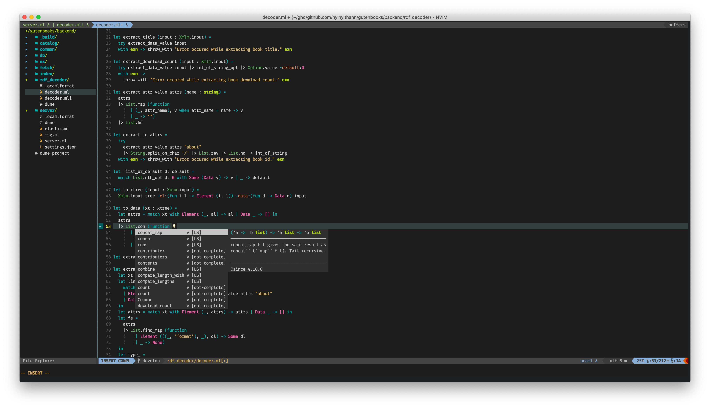
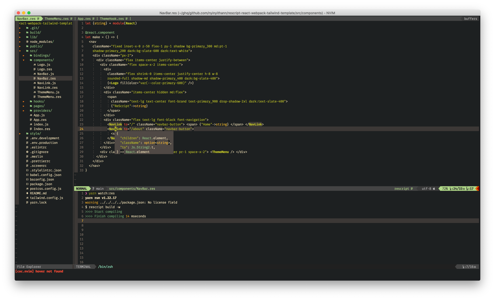
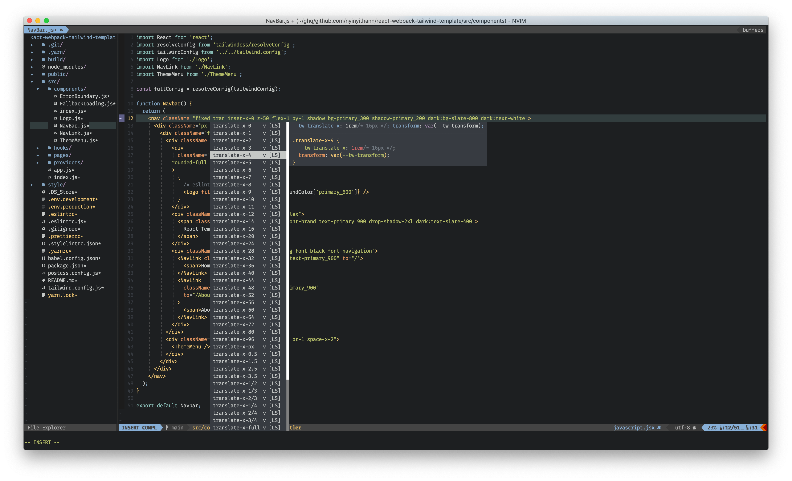

## My dotfiles

This repo contains config files for the following dev tools i use daily.

- [Alacritty](https://github.com/alacritty/alacritty)
- [Kitty](https://sw.kovidgoyal.net/kitty/)
- [Tmux](https://github.com/tmux/tmux)
- [NeoVim](https://neovim.io/)
- [zsh](https://github.com/ohmyzsh/ohmyzsh)
- [VSCode](https://code.visualstudio.com/)
- [git](https://git-scm.com/)

## My NeoVim Mappings

| Key                | Description                                                                                                                                                                | Source            |
| ------------------ | -------------------------------------------------------------------------------------------------------------------------------------------------------------------------- | ----------------- |
| `<leader>fl`       | lines                                                                                                                                                                      | fzf               |
|  `<leader>fb `     | buffers                                                                                                                                                                    | fzf               |
|  `<leader> ff `    | files                                                                                                                                                                      | fzf               |
|  `<leader> fc `    | theme colors                                                                                                                                                               | fzf               |
|  `<leader> fag `   | Ag                                                                                                                                                                         | fzf               |
|  `<leader> frg `   | Rg                                                                                                                                                                         | fzf               |
|  `<leader> fbl `   | current buffer lines                                                                                                                                                       | fzf               |
|  `<leader> ft `    | tags                                                                                                                                                                       | fzf               |
|  `<leader> fbt `   | current buffer tags                                                                                                                                                        | fzf               |
|  `<leader> fm `    | marks                                                                                                                                                                      | fzf               |
|  `<leader> fw `    | windows                                                                                                                                                                    | fzf               |
|  `<leader> fhc `   | command history                                                                                                                                                            | fzf               |
|  `<leader> fhs `   | search history                                                                                                                                                             | fzf               |
|  `<leader> fcmd`   | commands                                                                                                                                                                   | fzf               |
|  `<leader> fkey`   | maps                                                                                                                                                                       | fzf               |
|  `<leader> fft `   | filetypes                                                                                                                                                                  | fzf               |
|  `<leader> fs `    | snippets                                                                                                                                                                   | fzf               |
|  `<leader> fg `    | git commits                                                                                                                                                                | fzf               |
|  `<leader> fgb `   | git buffer commits                                                                                                                                                         | fzf               |
| `<leader> e`       | toggle nerdtree                                                                                                                                                            | nerdtree          |
| `<leader> nf`      | focus nerdtree                                                                                                                                                             | nerdtree          |
| `<leader> w`       | window picker                                                                                                                                                              | nvim-window       |
| `<leader> m`       | highlight to jump                                                                                                                                                          | easy motion       |
| `<leader> T`       | new buffer                                                                                                                                                                 | vim               |
| `<leader> bn`      | next buffer                                                                                                                                                                | vim               |
| `<leader> bp`      | prev buffer                                                                                                                                                                | vim               |
| `<leader> bq`      | close current buffer and move to prev one                                                                                                                                  | vim               |
| `<leader> Right`   | vertical resize +5                                                                                                                                                         | vim               |
| `<leader> Left`    | vertical reisze -5                                                                                                                                                         | vim               |
| `<leader> UP`      | resize +5                                                                                                                                                                  | vim               |
| `<leader> DOWN`    | resize -5                                                                                                                                                                  | vim               |
| `<leader> no`      | newline without leaving normal mode                                                                                                                                        | vim               |
| `<leader> nO`      | newline above without leaving normal mode                                                                                                                                  | vim               |
| `<leacer> h/k/j/l` | navigating windows                                                                                                                                                         | vim               |
| `<leader> z`       | toggle fold                                                                                                                                                                | vim               |
| `<leader> tn`      | new tab                                                                                                                                                                    | vim               |
| `<leader> tc`      | close tab                                                                                                                                                                  | vim               |
| `<leader> tl`      | next tab                                                                                                                                                                   | vim               |
| `<leader> th`      | prev tab                                                                                                                                                                   | vim               |
| `gd`               | definition                                                                                                                                                                 | coc               |
| `gt`               | type definition                                                                                                                                                            | coc               |
| `gi`               | implementation                                                                                                                                                             | coc               |
| `gr`               | references                                                                                                                                                                 | coc               |
| `gl`               | diagnostics next                                                                                                                                                           | coc               |
| `gh`               | diagnostics prev                                                                                                                                                           | coc               |
| `;ca`              | code action                                                                                                                                                                | coc               |
| `;rn`              | rename                                                                                                                                                                     | coc               |
| `;a`               | cocList diagnostics                                                                                                                                                        | coc               |
| `;x`               | coclist extensions                                                                                                                                                         | coc               |
| `;m`               | coclist commands                                                                                                                                                           | coc               |
| `;o`               | coclist outline                                                                                                                                                            | coc               |
| `;s`               | coclist symbols                                                                                                                                                            | coc               |
| `;l`               | CocList                                                                                                                                                                    | coc               |
| `K`                | show documentation (hover)                                                                                                                                                 | coc               |
| `<C-space>`        | trigger completion                                                                                                                                                         | coc               |
| `:Fmt`             | format                                                                                                                                                                     | coc               |
| `:Fl`              | fold                                                                                                                                                                       | coc               |
| `:OR`              | organize imports                                                                                                                                                           | coc               |
| `<A- h/k/j/l>`     | move lines                                                                                                                                                                 | vim-move          |
| `ft`               | toggle float window                                                                                                                                                        | float-term        |
| `fn`               | new float window                                                                                                                                                           | float-term        |
| `:BufOnly`         | close other buffers except the active one                                                                                                                                  | vim               |
| `<C-r>`            | By pressing ctrl+r in visual mode, you will be prompted to enter text to replace with. Press enter and then confirm each change you agree with y or decline with n.  | vim (Visual Mode) |
| `<A- h/k/j/l>`     | terminal windows navigation                                                                                                                                                | vim (terminal)    |
| `rd`               | jump to definition                                                                                                                                                         | rescript          |
| `rf`               | format                                                                                                                                                                     | rescript          |
| `rt`               | type hint                                                                                                                                                                  | rescript          |
| `rb`               | build                                                                                                                                                                      | rescript          |

### Screenshots

#### OCaml in NeoVim

#### ReScript in NeoVim

#### JavaScript in NeoVim

