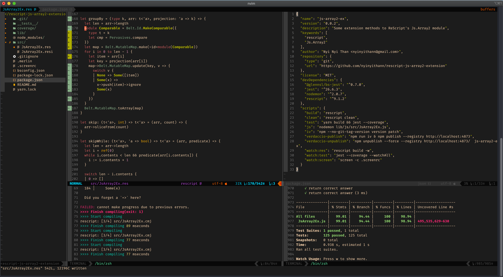
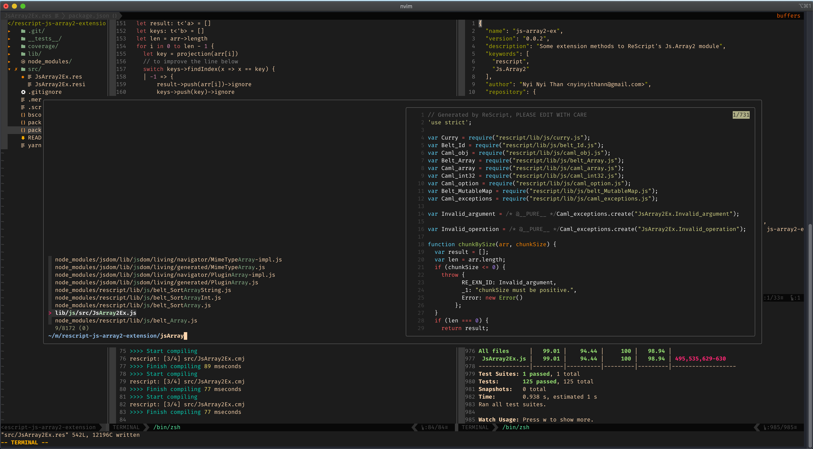

## My dev env config files on Mac

### Configs
- ## My dev env config files on Mac

### Configs
- [NeoVim](./mac/init.vim)
- [coc.vim](./mac/coc-settings.json)
- [zshrc](./mac/.zshrc)
- [zprofile](./mac/.zprofile)
- [karabiner](./mac/karabiner.json)
- [kitty](./mac/kitty.conf)

### Shortcuts
- [shortcuts](./mac/shortcuts.md)

##  My dev env config files on Ubuntu

### Configs
- [NeoVim](./ubuntu/init.vim)
- [coc.vim](./ubuntu/coc-settings.json)
- [VS Code Settings](./ubuntu/vscode_settings.json)
- [VS Code KeyBindings](./ubuntu/vscode_keybindings.json)
- [Kitty Terminal](./ubuntu/kitty.conf)
- [Oh My Z!](./ubuntu/.zshrc)

### Shortcuts
- [NeoVim](./ubuntu/vim_keys.md)
- [VS Code Vim Mode](./ubuntu/vscode_vim_mode.md)

### Screenshots of My NeoVim

